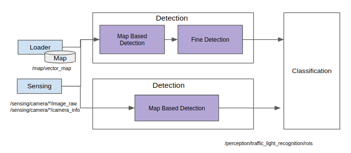

# Detection

## Use Cases and Requirements

Detection in Traffic Light Recognition is required for use cases involved with traffic light:

- Passing intersection when traffic signal is green
- Stopping at intersection when traffic signal is red

For the details about related requirements, please refer to the [document for Perception stack](/design/Perception/Perception.md).

## Role

Detection module in Traffic Light Recognition finds traffic lights' region of interest(ROI) in the image. For example, one image could contain many traffic signals at intersection. However, the number of traffic signals, in which an autonomous vehicle is interested, is limited. Map information is used to point the part of an image which needs to be paid attention to.

## Input

| Input       | Data Type                        | Topic                          |
| ----------- | -------------------------------- | ------------------------------ |
| Camera      | `sensor_msgs::Image`             | /sensing/camera/\*/image_raw   |
| Camera info | `sensor_msgs::CameraInfo`        | /sensing/camera/\*/camera_info |
| Map         | `autoware_lanelet2_msgs::MapBin` | /map/vector_map                |
| TF          | `tf2_msgs::TFMessage`            | /tf                            |

## Output

| Output                                | Data Type                                            | Output Module                             | Topic                                      |
| ------------------------------------- | ---------------------------------------------------- | ----------------------------------------- | ------------------------------------------ |
| Cropped traffic light ROI information | `autoware_perception_msgs::TrafficLightRoiArray.msg` | Traffic Light Recognition: Classification | /perception/traffic_light_recognition/rois |

## Design

The Detection module is designed to modularize some patterns of detecting traffic lights' ROI.

This is our sample implementation for the Detection module.

Our sample implementation has one advantage over Map-only Detection method, which sometimes suffers from calibration error. In our approach, Map Based Detection passes rough ROIs to Fine Detection so that it would not care minor calibration error. Fine Detection refines the passed rough ROI to accurately cropped traffic signals' ROI.
